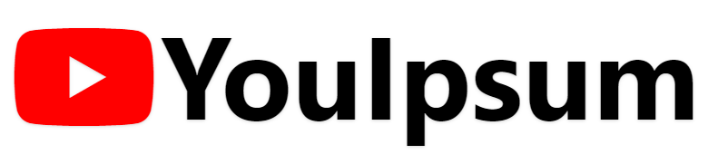

<p align="center"></a></p>

# YouIpsum

**YouIpsum** is a modest attempt at cloning the front end of YouTube's landing page.

The project is composed of a zoning, a wireframe and a final mockup, each model built on the previous one.

_The project is intended as a front end web development exercise._

_YouTube's logo and web design is the property of Google._

https://sximenez.github.io/youIpsum

## About

YouTube is the world's most popular website with more than [8 billion](https://ahrefs.com/blog/most-visited-websites/) visitors each month (Dec 2022).

## Libraries used

- Tailwind CSS
- Font Awesome

## UX

### Zoning

YouTube's landing page has three main zones: a **nav** on top, an **aside** (```hidden``` in mobile) and a **main** or app zone with an ```overflow-y-scroll```-like effect.

### Wireframe

YouTube uses a ```grid``` and a set of CSS variables with media queries to deal with the responsiveness of its app zone (the small video cards).

The variables can then be reused for other calculations such as ```width``` for example.

```CSS
.card-items-per-row {
      --items-per-row: 1;
    }

    @media (min-width: 376px) {
      .card-items-per-row {
        --items-per-row: 2;
      }
    }

    @media (min-width: 835px) {
      .card-items-per-row {
        --items-per-row: 3;
      }
    }

    @media (min-width: 1440px) {
      .card-items-per-row {
        --items-per-row: 4;
      }
    }

    @media (min-width: 2000px) {
      .card-items-per-row {
        --items-per-row: 5;
      }
    }

    @media (min-width: 2560px) {
      .card-items-per-row {
        --items-per-row: 6;
      }
    }

    .card-columns-per-row {
      grid-template-columns: repeat(var(--items-per-row), minmax(0, 1fr));
    }
  ```

hello